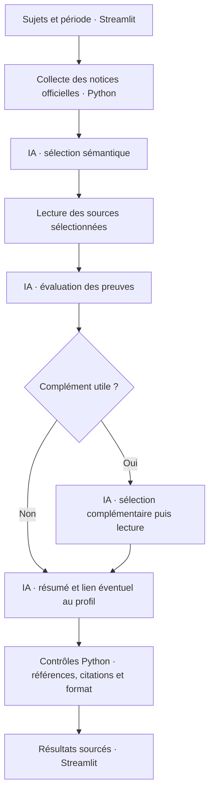

# Sed Lex

**Comprendre les textes qui vous concernent, à partir de sources officielles.**

Prototype développé pour **X-IA — Rise of Agents X**, du 25 au 27 septembre 2026.
Par **Arseniy, Jihane et Ryane**.

[Tester le projet](docs/TESTER.md) · [Fonctionnement de l’agent](docs/ANALYSE_AGENTIQUE.md) · [Sources et couverture](docs/ACTUALITES_RECENTES.md) · [Fiche de remise](docs/SOUMISSION.md)

---

## Le problème

Une proposition de loi, un amendement ou un débat peuvent concerner le logement,
les études ou le travail. Pourtant, les retrouver, comprendre leur contenu et
identifier leur étape de procédure demande de parcourir plusieurs sites et un
vocabulaire spécialisé.

**Sed Lex aide à passer d’un sujet de la vie quotidienne à des textes sourcés et
à une explication accessible.** L’application informe, sans recommandation de vote
ni classement de responsables politiques.

## Ce que l’on peut faire

| Dans l’application | Ce que cela apporte |
| --- | --- |
| **Rechercher** un ou plusieurs sujets, sur une période choisie | Une sélection IA dans les notices parlementaires collectées |
| **Comprendre** les nouveautés | Des résumés de 600 caractères maximum, avec liens vers les sources |
| **Renseigner sa situation**, facultativement | Un lien concret avec le profil lorsqu’il est étayé, et un ordre adapté |
| **Consulter les sources législatives** | Des pages officielles ; les répétitions sont regroupées, les étapes distinctes conservées |
| **Retrouver une recherche ou un favori** | Un historique de session et des étoiles, sans nouvelle génération IA |

Le profil, l’historique et les favoris restent dans la session du navigateur.
Aucun compte Google n’est nécessaire. Un redémarrage ou une nouvelle session peut
les effacer. Les réponses explicites du questionnaire peuvent être transmises à
la synthèse ; le nom du profil n’est pas transmis.

## Un véritable parcours agentique

Pipelex orchestre des étapes LLM utilisant **OpenAI `gpt-4o-mini`** dans le mode
local recommandé. L’IA sélectionne les documents selon leur sens, évalue les
preuves, décide si un complément est utile, puis rédige la synthèse.



La boucle est bornée : **un seul complément**, généralement trois appels LLM,
quatre avec complément. Aucun nouvel essai automatique ni changement de fournisseur.
Les données collectées ne peuvent pas choisir les outils ou remplacer les consignes.

[Lire les étapes, les budgets et les contrôles →](docs/ANALYSE_AGENTIQUE.md)

## Tester en local

**Prérequis : Python 3.12, Internet et une clé API OpenAI avec des crédits pour
la recherche réelle.** Le moteur Pipelex est installé localement. Aucun accès
Dust, Google ou Pipelex hébergé n’est nécessaire pour ce mode.

Le dépôt ne contient aucune clé d’équipe. Sans clé, l’interface et les tests hors
ligne restent accessibles ; le bouton de recherche est désactivé par défaut.

### 1. Récupérer et installer

Sur macOS/Linux, depuis un nouveau dossier :

```bash
git clone --branch feat/pipelex-comparison https://github.com/jbelhoussineX/X-AI-Hackathon.git
cd X-AI-Hackathon
python --version                 # Python 3.12
python -m venv .venv
.venv/bin/python -m pip install -r requirements-ui.txt
cp .env.example .env
```

**Windows / PowerShell :** suivre les commandes équivalentes dans le
[guide du testeur](docs/TESTER.md). La configuration `.pipelex/` est déjà livrée ;
il n’est pas nécessaire de lancer `pipelex init`.

### 2. Configurer localement

Dans le nouveau `.env`, renseigner sa propre clé et activer le mode local :

```dotenv
OPENAI_API_KEY=remplacer_localement_par_sa_cle
PIPELEX_EXECUTION_MODE=local
ENABLE_PIPELEX_CALLS=true
DO_NOT_TRACK=1
```

`.env` est ignoré par Git. `PIPELEX_API_KEY` peut rester vide. La configuration
se charge au démarrage ; les variables déjà définies dans le terminal sont
prioritaires. Une recherche réelle consomme les crédits associés à la clé.

### 3. Lancer

```bash
.venv/bin/python -m streamlit run app.py --server.address 127.0.0.1 --server.port 8502 --browser.gatherUsageStats false
```

Ouvrir **http://localhost:8502** et garder le terminal ouvert. Choisir un sujet,
par exemple **logement**, une période, puis cliquer sur **Rechercher**.
Le profil est facultatif. Aucun appel IA ne part au simple démarrage ou lors d’un
clic sur un favori.

[Installation détaillée et résolution des problèmes →](docs/TESTER.md)

## Sources, garanties et limites

- **Sources officielles :** dossiers de la 17e législature de l’Assemblée nationale,
  export DOSLEG du Sénat, publications, amendements et comptes rendus parlementaires.
  Les textes explicitement liés aux dossiers peuvent être lus pour expliquer les mesures.
- **Statuts distincts :** un dépôt, un débat, une adoption et une promulgation ne
  sont pas interchangeables. Une mise en ligne récente ne prouve pas une nouvelle loi.
- **Contrôles effectifs :** seules des références présentes dans le corpus sont
  acceptées ; les citations doivent se trouver dans les passages effectivement collectés.
- **Limites assumées :** au plus 120 notices candidates et six événements par
  sélection. Les passages sont partiels ; la version d’un texte lié peut être ancienne.
  La collecte n’est pas exhaustive et aucun statut de droit en vigueur n’est certifié.
- **Lecture humaine nécessaire :** la présence d’une citation ne garantit pas que
  le modèle l’interprète correctement. Si la source n’explique pas une mesure,
  l’IA doit le signaler plutôt que l’inventer.

Pas de presse généraliste ni de réseaux sociaux dans le parcours livré. Pas de
profil politique, d’email automatique ou de contenu fictif substitué à une erreur.

[Sources et fraîcheur →](docs/ACTUALITES_RECENTES.md) · [Contrôles manuels →](docs/TESTS_MANUELS.md)

## Validation sans appel IA payant

```bash
PYTHON_DOTENV_DISABLED=1 DO_NOT_TRACK=1 .venv/bin/python -m pytest -q
.venv/bin/python -m pip check
```

**Dernière vérification : 561 tests et 28 sous-tests réussis**, y compris dans une
copie isolée sans les secrets ni les données locales de l’équipe. L’installation
a été résolue en simulation sur Python 3.12 ; les dépendances de l’environnement
utilisé passent `pip check`. Les appels fournisseurs sont simulés pendant les tests.
Ces contrôles ne prouvent ni le crédit disponible d’un évaluateur ni la qualité
d’une génération réelle. Aucun appel IA payant n’a été lancé pour cette vérification.

## Dans le dépôt

```text
app.py                      Démarrage Streamlit
frontend/                   Recherche, profil, historique et favoris
backend/recent_agent.py     Sélection, évaluation, complément et synthèse
backend/data_sources/       Collecte des données et pages officielles
methods/recent_agent/       Étapes LLM définies avec Pipelex
src/recent_agent_worker.py  Exécution isolée et diagnostics filtrés
tests/                      Vérifications hors ligne et réponses simulées
docs/                       Installation, architecture, sources et remise
```

Les anciens adaptateurs Dust, rapports v1 et outils de comparaison restent dans
le dépôt pour la compatibilité et leurs tests. Ils ne constituent pas le parcours
présenté dans l’interface. [Repères techniques →](docs/DEVELOPPEMENT.md)

## Équipe et remise

**Arseniy · Jihane · Ryane**

Le projet a été créé pendant le hackathon ; selon la déclaration de l’équipe,
aucun projet préexistant n’a été repris. Les bibliothèques utilisées restent des
dépendances tierces.

**Vidéo de présentation : lien à ajouter avant la remise — durée maximale 2 minutes.**
La [fiche de remise](docs/SOUMISSION.md) contient la description courte et le déroulé
proposé pour la vidéo. Échéance indiquée dans le règlement : **27 septembre 2026, 23 h 59**.

---

Python · Streamlit · Pipelex · OpenAI — [Licence MIT](LICENSE)
